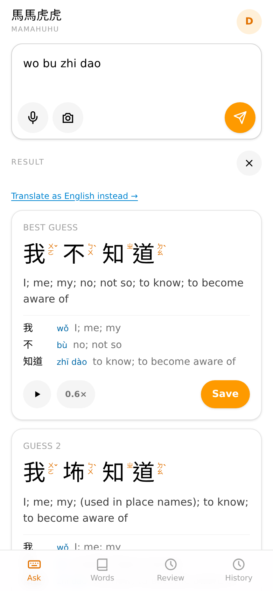
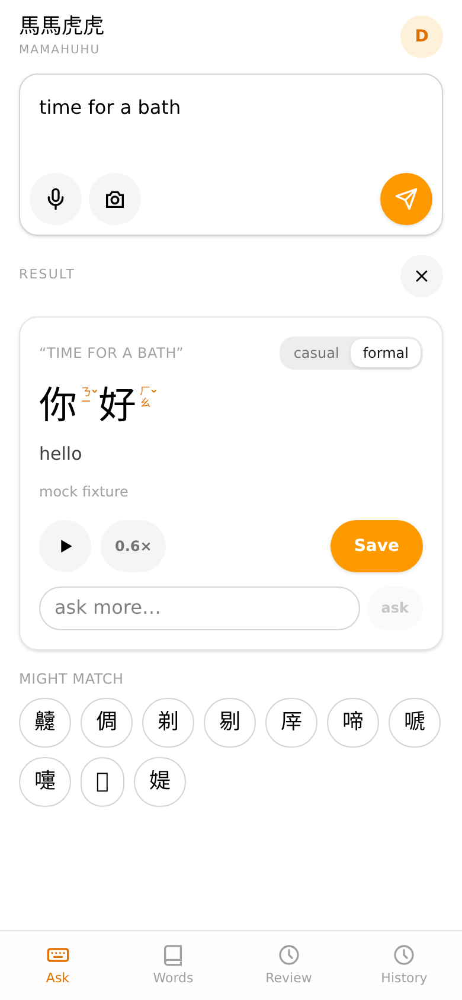
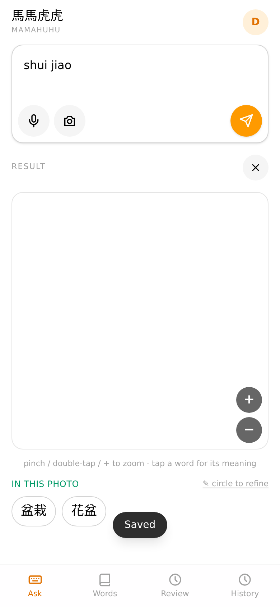
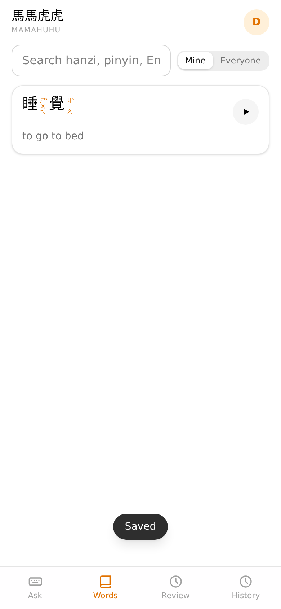
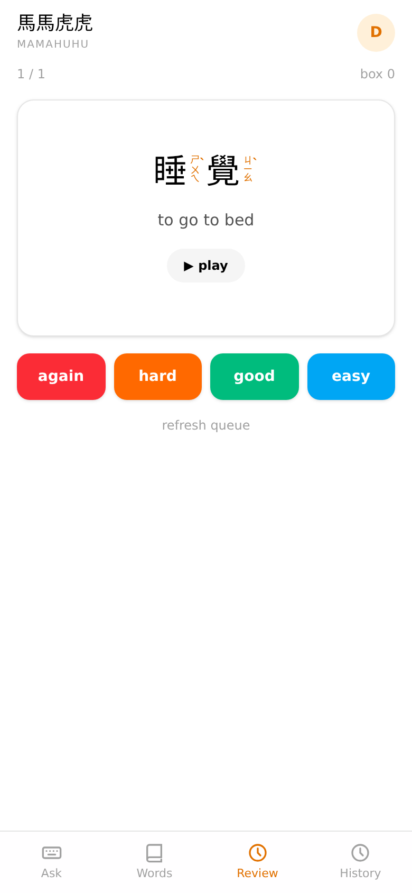
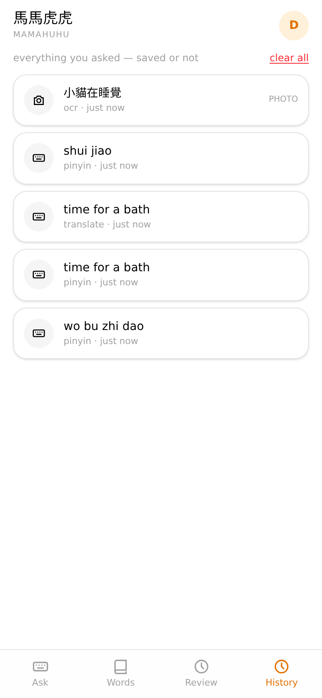

# Mamahuhu 馬馬虎虎

Mobile-first Mandarin companion for a parent keeping up with a toddler.
Ask — by typing, speaking, or photographing — see Traditional hanzi with
bopomofo and pinyin, save it, review it. 90% phone usage, ~15–30 second
interactions.

<div align="center">
  
  
  
</div>
<div align="center">
  <em>Rough pinyin in → best dictionary interpretations. English → casual/formal registers with sense chips.</em>
</div>

<div align="center">
  
  
  
</div>
<div align="center">
  <em>Your saved words (searchable by hanzi, pinyin, English, or topic tags). Leitner-box flashcards. Every ask, saved or not.</em>
</div>

## The four inputs

| Mode | What happens |
|---|---|
| **Type** | English → intent-first translation (casual + formal registers, alternative senses, meta-question handling: *"how do you say airplane"* → 飛機). Garbled pinyin → local dictionary interpreter ranks phrase interpretations instantly, no LLM call. Hanzi paste → word cards. Mixed scripts route intelligently. |
| **Speak** | Mic with auto language detection (Mandarin-first, flips on Latin speech — no language picker). Live transcript streams into the input box. Browser SpeechRecognition out of the box; whisper-class server STT via `MODEL_STT`. |
| **Photo** | Native camera/library/file menu. Vision OCR (qwen3.8, benchmarked 0% CER vs tesseract 26%) → tappable word chips on the image with pinch-zoom (crisp, position-tracked), in-place definition cards, saved-word badges. Simplified print displays Traditional (CEDICT-indexed both scripts + char-level conversion). |
| **Attach** | Images and PDFs (pages rendered and OCRed with a page switcher). |

Every photo also gets **subject tags** — textless photos (a plant, a dog) come
back with ranked Mandarin name tags, and **circle-to-refine** lets you loop the
exact object. Any card supports **follow-up questions** (*"what kind of tree?"*)
— photo-aware via the vision model.

## Learning loop

- **Words**: per-user lists + a shared *Everyone* view; search matches hanzi,
  pinyin, English, and **LLM-generated topic tags** (search "airport" → 飛機).
- **Review**: Leitner 6-box SRS (10m → 1h → 8h → 1d → 3d → 7d). Flip card,
  grade again/hard/good/easy. All new words are due immediately.
- **History**: every ask recorded — photos reopen in the full overlay viewer,
  transcripts, results. Per-entry delete and clear-all.
- **Audio**: server TTS (kokoro) with a disk cache under `DATA_DIR/audio` —
  one synthesis per phrase, instant replay. Browser speech fallback when no
  model is configured.

## Annotations

Bopomofo stacked **vertically beside** each character (tone mark to the right,
˙ on top) — Taiwan textbook layout — with pinyin below. Per-user preference
(both / bpmf only / pinyin only), remembered. Family policy: **simplified
input always displays traditional**.

## Deploy

Docker: multi-arch images published to `ghcr.io/lenaxia/mamahuhu` on every
semver tag.

```yaml
# bjw-s/app-template v3 — see deploy/helm-values.yaml
image: ghcr.io/lenaxia/mamahuhu:0.3.0
env:
  DATA_DIR: /data          # PVC — sqlite, photos, audio cache
  TRUST_PROXY_HEADERS: "1" # forward-auth identity (Authelia/Authentik)
  AUTH_HEADER: x-authentik-username
  MODEL_CHAT: default      # LiteLLM: qwen3.8 chat
  MODEL_VISION: default    # qwen3.8 vision (OCR)
  MODEL_TTS: kokoro        # TTS_VOICE: zf_xiaoxiao
  MODEL_FAST: classifier   # entry tagging
```

SQLite by default; Postgres via `DB_DRIVER=postgres` + `DATABASE_URL` (identical
schemas; `npm run export:db` / `import:db` to migrate). Full config in
[SPEC.md](SPEC.md).

## Development

```bash
npm install
npm run dev            # API :8787 + vite :5173
npm run typecheck      # strict + noUncheckedIndexedAccess
npm test               # 145 unit + API contract tests (vitest)
npm run test:e2e       # Playwright, mobile viewport, LLM mocked
npm run build          # vite + esbuild → dist/
```

Architecture: React 19 + Vite + Tailwind v4 client; Hono server; zod schemas
in `src/shared/api.ts` are the single API contract; service seams
(`src/server/ports.ts`) swap gateway/mock/browser implementations. CC-CEDICT
(124k entries) powers all pinyin/zhuyin/definition lookups locally — the LLM
only does what a dictionary can't. See `bench/ocr-report.md` for the engine
benchmark.

MIT licensed. Dictionary data is
[CC-CEDICT](https://www.mdbg.net/chinese/dictionary?page=cedict) (CC BY-SA 4.0)
via the `cedict-json` package.
